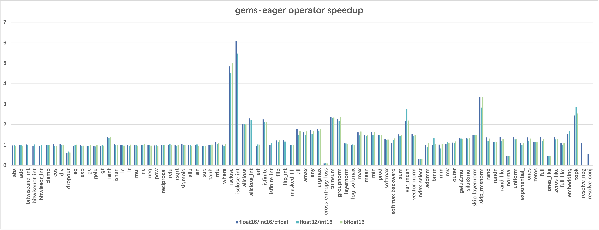

[中文版](./README_cn.md)

## Introduction

FlagGems is a high-performance general operator library implemented in [OpenAI Triton](https://github.com/openai/triton). It aims to provide a suite of kernel functions to accelerate LLM training and inference.

By registering with the ATen backend of PyTorch, FlagGems facilitates a seamless transition, allowing users to switch to the Triton function library without the need to modify their model code. Users can still utilize the ATen backend as usual while experiencing significant performance enhancement. The Triton language offers benefits in readability, user-friendliness and performance comparable to CUDA. This convenience allows developers to engage in the development of FlagGems with minimal learning investment.


## Feature

### Automatic Codegen

In FlagGems, we provide automatic code generation that developers can use to conveniently generate pointwise single operators and pointwise fused operators. Automatic code generation can handle various needs such as normal pointwise computations, non-tensor arguments, and specifying output data types.

#### Normal Pointwise Operator

Decorating the pointwise operator function with `pointwise_dynamic` can save the manual handling of tensor addressing, tensor read/write, parallel tiling, tensor broadcasting, dynamic dimensions, non-contiguous storage, etc. For example, in the following code, developers only need to describe the computational logic to generate flexible and efficient Triton code.

```python
@pointwise_dynamic(promotion_methods=[(0, "COMPLEX_TO_FLOAT")])
@triton.jit
def abs_func(x):
    return tl.abs(x)
```

#### Non-Tensor Argument

By default, `pointwise_dynamic` treats all parameters as tensors, and by passing a list of boolean values to the parameter `is_tensor`, developers can specify which parameters are tensors and which are not. Additionally, developers can pass in `dtypes` to indicate the data types of non-tensor parameters, but this is not required. For example, in the following code, the `alpha` parameter is defined as a non-tensor floating point number, while the `x` and `y` parameters are defined as tensors.

```python
@pointwise_dynamic(
    is_tensor=[True, True, False],
    dtypes=[None, None, float],
    promotion_methods=[(0,"DEFAULT")]
)
@triton.jit
def add_func(x, y, alpha):
    return x + y * alpha
```

#### Output Data Type

Furthermore, developers MUST provide promotion_methods to specify how type promotion should be handled for the operation to achieve the correct output type during computation.

```python
@pointwise_dynamic(output_dtypes=[torch.bool])
@triton.jit
def ge(x, y):
    return x > y
```

In `promotion_methods`, an `int` is used to indicate the position of the parameter requiring type promotion, while a `str` denotes the method of type promotion. The `str` corresponds to the following enumerated types:

```python
class ELEMENTWISE_TYPE_PROMOTION_KIND(Enum):
    DEFAULT = (0,)
    NO_OPMATH = (1,)
    INT_TO_FLOAT = (2,)
    ALWAYS_BOOL = (3,)
    COMPLEX_TO_FLOAT = (4,)
    BOOL_TO_LONG = (5,)
```

Examples：

- `DEFAULT` ：add
- `NO_OPMATH` ： where, nextafter, cat
- `INT_TO_FLOAT` ：sin
- `ALWAYS_BOOL` ：eq
- `COMPLEX_TO_FLOAT` ：abs
- `BOOL_TO_LONG` ：pow

## Changelog

### v1.0
- support BLAS operators: addmm, bmm, mm
- support pointwise operators: abs, add, div, dropout, exp, gelu, mul, pow, reciprocal, relu, rsqrt, silu, sub, triu
- support reduction operators: cumsum, layernorm, mean, softmax

### v2.0
- support BLAS operators: mv, outer
- support pointwise operators: bitwise_and, bitwise_not, bitwise_or, cos, clamp, eq, ge, gt, isinf, isnan, le, lt, ne, neg, or, sin, tanh, sigmoid
- support reduction operators: all, any, amax, argmax, max, min, prod, sum, var_mean, vector_norm, cross_entropy_loss, group_norm, log_softmax, rms_norm
- support fused operators: skip_rms_norm, skip_layer_norm, gelu_and_mul, silu_and_mul, apply_rotary_position_embedding

### v2.1
- support Tensor operators: where, arange, repeat, masked_fill, tile, unique, index_select, masked_select, ones, ones_like, zeros, zeros_like, full, full_like, flip, pad
- support neural network operator: embedding
- support basic math operators: allclose, isclose, isfinite, floor_divide, trunc_divide, maximum, minimum
- support distribution operators: normal, uniform_, exponential_, multinomial, nonzero, topk, rand, randn, rand_like, randn_like
- support science operators: erf, resolve_conj, resolve_neg

## Quick Start

### Requirements

1. Triton >= 2.2.0
2. PyTorch >= 2.2.0
3. Transformers >= 4.40.2

### Installation

```shell
git clone https://github.com/FlagOpen/FlagGems.git
cd FlagGems
pip install .
```

## Usage

### Import

1. Enable permanently
    ```python
    import flag_gems
    flag_gems.enable()
    ```

2. Enable temporarily
    ```python
    import flag_gems
    with flag_gems.use_gems():
        pass
    ```

3. Example
    ```python
    import torch
    import flag_gems

    M, N, K = 1024, 1024, 1024
    A = torch.randn((M, K), dtype=torch.float16, device="cuda")
    B = torch.randn((K, N), dtype=torch.float16, device="cuda")
    with flag_gems.use_gems():
        C = torch.mm(A, B)
    ```

### Execute

1. Test Operator Accuracy
    - Run reference on cuda
        ```shell
        cd tests
        pytest test_xx_ops.py
        ```
    - Run reference on cpu
        ```shell
        cd tests
        pytest test_xx_ops.py --device cpu
        ```

2. Test Model Accuracy
    ```shell
    cd examples
    pytest model_xx_test.py
    ```

3. Test Operator Performance
    - Test CUDA performance
        ```shell
        cd benchmark
        pytest test_xx_perf.py -s
        ```
    - Test end-to-end performance
        ```shell
        cd benchmark
        pytest test_xx_perf.py -s --mode cpu
        ```

4. Run tests with logging infomation
    ```shell
    pytest program.py --log-cli-level debug
    ```
    Not recommended in performance testing.

## Supported Operators

Operators will be implemented according to [OperatorList.md](./OperatorList.md).

## Supported Models

- Bert-base-uncased
- Llama-2-7b
- Llava-1.5-7b

## Supported Platforms

| Platform | float16 | float32 | bfloat16 |
| :---: | :---: | :---: | :---: |
| Nvidia A100 | ✓ | ✓ | ✓ |

## Performance

The following chart shows the speedup of FlagGems compared with PyTorch ATen library in eager mode. The speedup is calculated by averaging the speedup on each shape, representing the overall performance of the operator.



## Contributions

If you are interested in contributing to the FlagGems project, please refer to [CONTRIBUTING.md](./CONTRIBUTING.md). Any contributions would be highly appreciated.

## Contact us

If you have any questions about our project, please submit an issue, or contact us through <a href="mailto:flaggems@baai.ac.cn">flaggems@baai.ac.cn</a>.

## License

The FlagGems project is based on [Apache 2.0](./LICENSE).
