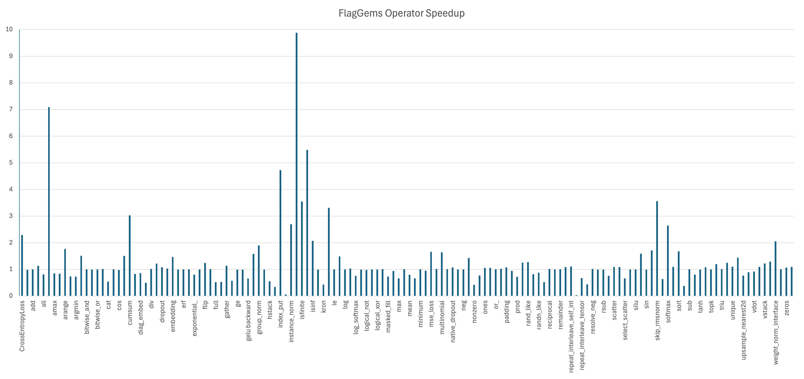

[中文版](./README_cn.md)


## Introduction

FlagGems is a high-performance general operator library implemented in [OpenAI Triton](https://github.com/openai/triton). It builds on a collection of backend neutral kernels that aims to accelerate LLM training and inference across diverse hardware platforms.

By registering with the ATen backend of PyTorch, FlagGems facilitates a seamless transition, allowing model developers to switch to Triton without changing the low level APIs. Users can still use their familiar Pytorch APIs as usual and benefit from new hardware acceleration technologies. For kernel developers, the Triton language offers readability, user-friendliness and performance comparable to CUDA. This convenience allows developers to engage in the development of FlagGems with minimal learning investment.

We created WeChat group for FlagGems. Scan the QR code to join the group chat! To get the first hand message about our updates and new release, or having any questions or ideas, join us now!

<p align="center">

</p>

## Features

FlagGems provides the following technical features.

- A large collection of PyTorch compatible operators
- Hand optimized performance for selective operators
- Eager mode ready, independent of `torch.compile`
- Automatic pointwise operator codegen supporting arbitrary input types and layout
- Fast per-function runtime kernel dispatching
- Multi-backend interface enabling support of diverse hardware platforms
- Over 10 supported backends
- C++ Triton function dispatcher (working in progress)

## More About Features

### Multi-Backend Hardware Support

FlagGems supports a wide range of hardware platforms and has been extensively tested across different hardware configurations.

### Automatic Codegen

FlagGems provides an automatic code generation mechanism that enables developers to easily generate both pointwise and fused operators.
The auto-generation system supports a variety of needs, including standard element-wise computations, non-tensor parameters, and specifying output types.
For more details, please refer to [pointwise_dynamic](docs/pointwise_dynamic.md).

### LibEntry

FlagGems introduces `LibEntry`, which independently manages the kernel cache and bypasses the runtime of `Autotuner`, `Heuristics`, and `JitFunction`. To use it, simply decorate the Triton kernel with LibEntry.

`LibEntry` also supports direct wrapping of `Autotuner`, `Heuristics`, and `JitFunction`, preserving full tuning functionality. However, it avoids nested runtime type invocations, eliminating redundant parameter processing. This means no need for binding or type wrapping, resulting in a simplified cache key format and reduced unnecessary key computation.

### C++ Runtime

FlagGems can be installed either as a pure Python package or as a package with C++ extensions. The C++ runtime is designed to address the overhead of the Python runtime and improve end-to-end performance.

## Changelog

### v3.0

- support 184 operators in total, including custom operators used in large model inference
- support more hardware platforms, add Ascend, AIPU, etc.
- compatible with the vLLM framework, with the inference verification of DeepSeek model passed

### v2.1

- support Tensor operators: where, arange, repeat, masked_fill, tile, unique, index_select, masked_select, ones, ones_like, zeros, zeros_like, full, full_like, flip, pad
- support neural network operator: embedding
- support basic math operators: allclose, isclose, isfinite, floor_divide, trunc_divide, maximum, minimum
- support distribution operators: normal, uniform\_, exponential\_, multinomial, nonzero, topk, rand, randn, rand_like, randn_like
- support science operators: erf, resolve_conj, resolve_neg

### v2.0

- support BLAS operators: mv, outer
- support pointwise operators: bitwise_and, bitwise_not, bitwise_or, cos, clamp, eq, ge, gt, isinf, isnan, le, lt, ne, neg, or, sin, tanh, sigmoid
- support reduction operators: all, any, amax, argmax, max, min, prod, sum, var_mean, vector_norm, cross_entropy_loss, group_norm, log_softmax, rms_norm
- support fused operators: fused_add_rms_norm, skip_layer_norm, gelu_and_mul, silu_and_mul, apply_rotary_position_embedding

### v1.0

- support BLAS operators: addmm, bmm, mm
- support pointwise operators: abs, add, div, dropout, exp, gelu, mul, pow, reciprocal, relu, rsqrt, silu, sub, triu
- support reduction operators: cumsum, layernorm, mean, softmax

## Get Start

For a quick start with installing and using flag_gems, please refer to the documentation [GetStart](docs/get_start_with_flaggems.md).

## Supported Operators

Operators will be implemented according to [OperatorList](docs/operator_list.md).

## Example Models

- Bert-base-uncased
- Llama-2-7b
- Llava-1.5-7b

## Supported Platforms

| vendor     | state                  | float16 | float32 | bfloat16 |
| ---------- | ---------------------- | ------- | ------- | -------- |
| aipu       | ✅ （Partial support） | ✅      | ✅      | ✅       |
| ascend     | ✅ （Partial support） | ✅      | ✅      | ✅       |
| cambricon  | ✅                     | ✅      | ✅      | ✅       |
| hygon      | ✅                     | ✅      | ✅      | ✅       |
| iluvatar   | ✅                     | ✅      | ✅      | ✅       |
| kunlunxin  | ✅                     | ✅      | ✅      | ✅       |
| metax      | ✅                     | ✅      | ✅      | ✅       |
| mthreads   | ✅                     | ✅      | ✅      | ✅       |
| nvidia     | ✅                     | ✅      | ✅      | ✅       |
| arm(cpu)   | 🚧                     |         |         |          |
| tsingmicro | 🚧                     |         |         |          |

## Performance

The following chart shows the speedup of FlagGems compared with PyTorch ATen library in eager mode. The speedup is calculated by averaging the speedup on each shape, representing the overall performance of the operator.



## Contributions

If you are interested in contributing to the FlagGems project, please refer to [CONTRIBUTING.md](./CONTRIBUTING.md). Any contributions would be highly appreciated.

## Citation

If you find our work useful, please consider citing our project:

```bibtex
@misc{flaggems2024,
    title={FlagOpen/FlagGems: FlagGems is an operator library for large language models implemented in the Triton language.},
    url={https://github.com/FlagOpen/FlagGems},
    journal={GitHub},
    author={BAAI FlagOpen team},
    year={2024}
}
```

## Contact us

If you have any questions about our project, please submit an issue, or contact us through <a href="mailto:contact@flagos.io">contact@flagos.io</a>.

## License

The FlagGems project is based on [Apache 2.0](./LICENSE).
