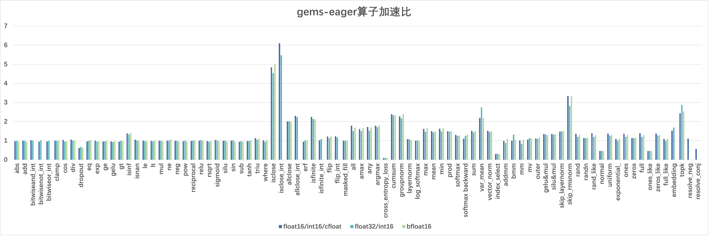

[English](./README.md)

## 介绍

FlagGems是一个使用OpenAI推出的[Triton编程语言](https://github.com/openai/triton)实现的高性能通用算子库，旨在为大语言模型提供一系列可应用于PyTorch框架的算子，加速模型的推理与训练。

FlagGems通过对PyTorch的后端aten算子进行覆盖重写，实现算子库的无缝替换，使用户能够在不修改模型代码的情况下平稳地切换到triton算子库。FlagGems不会影响aten后端的正常使用，并且会带来良好的性能提升。Triton语言为算子库提供了更好的可读性和易用性，同时保持了不逊于CUDA的算子性能，因此开发者只需付出较低的学习成本，即可参与FlagGems的算子开发与建设。


## 特性

### 自动代码生成

在FlagGems中，我们提供了一套自动代码生成的机制，开发者可以使用它来便捷地生成pointwise类型的单算子与融合算子。自动代码生成可以处理常规的对位计算、非张量参数、指定输出类型等多种需求。

#### 常规对位计算

在对位算子函数前装饰`pointwise_dynamic`，可以节省张量寻址、张量读写、并行分块、张量广播、动态维度、非连续存储等的手动处理。例如以下代码，开发者只需简单描述计算逻辑，即可生成灵活高效的Triton核函数与包装代码。

```python
@pointwise_dynamic(promotion_methods=[(0, "COMPLEX_TO_FLOAT")])
@triton.jit
def abs_func(x):
    return tl.abs(x)
```

#### 非张量参数

在默认情况下，`pointwise_dynamic`将所有参数均处理为张量，而通过向参数`is_tensor`传递布尔值列表，开发者可以指定哪些参数是张量，哪些参数非张量。此外，开发者还可以传入`dtypes`说明非张量参数的数据类型，但这不是必要的。例如以下代码，将`alpha`参数定义为非张量的浮点数，而`x`和`y`参数定义为张量。

```python
@pointwise_dynamic(
    is_tensor=[True, True, False],
    dtypes=[None, None, float],
    promotion_methods=[(0,"DEFAULT")]
)
@triton.jit
def add_func(x, y, alpha):
    return x + y * alpha
```

#### 输出数据类型

此外，开发者必须传入 `promotion_methods` 来说明该 Op 在进行计算时应该如何进行`类型提升`以获得正确的输出类型

```python
@pointwise_dynamic(promotion_methods=[(0, "ALWAYS_BOOL")])
@triton.jit
def ge(x, y):
    return x > y
```

`promotion_methods` 通过传入 `int` 来表示需要进行类型提升的参数位置, 通过传入 `str` 来表示类型提升的方式, `str` 对于以下枚举类型

```python
class ELEMENTWISE_TYPE_PROMOTION_KIND(Enum):
    DEFAULT = (0,)
    NO_OPMATH = (1,)
    INT_TO_FLOAT = (2,)
    ALWAYS_BOOL = (3,)
    COMPLEX_TO_FLOAT = (4,)
    BOOL_TO_LONG = (5,)
```

举例：

- `DEFAULT` ：add
- `NO_OPMATH` ： where, nextafter, cat
- `INT_TO_FLOAT` ：sin
- `ALWAYS_BOOL` ：eq
- `COMPLEX_TO_FLOAT` ：abs
- `BOOL_TO_LONG` ：pow

## 更新日志

### v1.0
- 支持BLAS类算子：addmm, bmm, mm
- 支持pointwise类算子：abs, add, div, dropout, exp, gelu, mul, pow, reciprocal, relu, rsqrt, silu, sub, triu
- 支持reduction类算子：cumsum, layernorm, mean, softmax

### v2.0
- 支持BLAS类算子: mv, outer
- 支持pointwise类算子: bitwise_and, bitwise_not, bitwise_or, cos, clamp, eq, ge, gt, isinf, isnan, le, lt, ne, neg, or, sin, tanh, sigmoid
- 支持reduction类算子: all, any, amax, argmax, max, min, prod, sum, var_mean, vector_norm, cross_entropy_loss, group_norm, log_softmax, rms_norm
- 支持融合算子: skip_rms_norm, skip_layer_norm, gelu_and_mul, silu_and_mul, apply_rotary_position_embedding

### v2.1
- 支持Tensor类算子：where, arange, repeat, masked_fill, tile, unique, index_select, masked_select, ones, ones_like, zeros, zeros_like, full, full_like, flip, pad
- 支持神经网络类算子：embedding
- 支持基础数学算子：allclose, isclose, isfinite, floor_divide, trunc_divide, maximum, minimum
- 支持分布类算子：normal, uniform_, exponential_, multinomial, nonzero, topk, rand, randn, rand_like, randn_like
- 支持科学计算算子：erf, resolve_conj, resolve_neg

## 快速入门

### 依赖

1. Triton >= 2.2.0
2. PyTorch >= 2.2.0
3. Transformers >= 4.40.2

### 安装

```shell
git clone https://github.com/FlagOpen/FlagGems.git
cd FlagGems
pip install .
```

## 使用

### 导入

1. 在进程中永久启用
    ```python
    import flag_gems
    flag_gems.enable()
    ```

2. 暂时启用
    ```python
    import flag_gems
    with flag_gems.use_gems():
        pass
    ```

3. 示例
    ```python
    import torch
    import flag_gems

    M, N, K = 1024, 1024, 1024
    A = torch.randn((M, K), dtype=torch.float16, device="cuda")
    B = torch.randn((K, N), dtype=torch.float16, device="cuda")
    with flag_gems.use_gems():
        C = torch.mm(A, B)
    ```

### 执行

1. 算子正确性测试
    - 在CUDA上运行参考实现
        ```shell
        cd tests
        pytest test_xx_ops.py
        ```
    - 在CPU上运行参考实现
        ```shell
        cd tests
        pytest test_xx_ops.py --device cpu
        ```
2. 模型正确性测试
    ```shell
    cd examples
    pytest model_xx_test.py
    ```

3. 算子性能测试
    - 测试CUDA性能
        ```shell
        cd benchmark
        pytest test_xx_perf.py -s
        ```
    - 测试端到端性能
        ```shell
        cd benchmark
        pytest test_xx_perf.py -s --mode cpu
        ```

2. 运行时打印日志信息
    ```shell
    pytest program.py --log-cli-level debug
    ```
    测试性能时不建议打开。

## 支持算子

算子将按照文档[OperatorList.md](./OperatorList.md)的顺序逐步实现。

## 支持模型

- Bert-base-uncased
- Llama-2-7b
- Llava-1.5-7b

## 支持平台

| Platform | float16 | float32 | bfloat16 |
| :---: | :---: | :---: | :---: |
| Nvidia A100 | ✓ | ✓ | ✓ |

## 性能表现

FlagGems相比Torch Eager模式下ATen算子库的加速比如下图所示。其中，每个算子的加速比综合了多个形状测例的数据，代表该算子的整体性能。



## 贡献代码

欢迎大家参与FlagGems的算子开发并贡献代码，详情请参考[CONTRIBUTING.md](/CONTRIBUTING_cn.md)。

## 联系我们

如有疑问，请提交issue，或发送邮件至<a href="mailto:flaggems@baai.ac.cn">flaggems@baai.ac.cn</a>。

## 证书

本项目基于[Apache 2.0](./LICENSE)。
