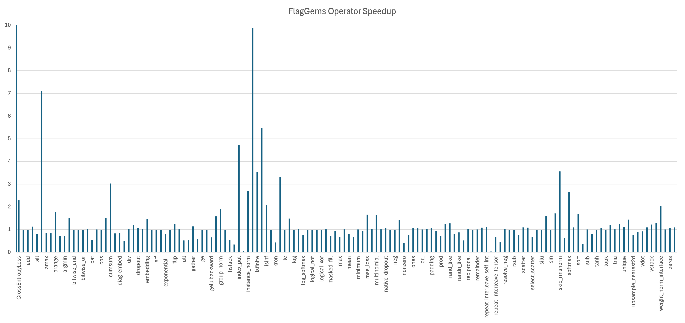

[English](./README.md)


## 介绍

FlagGems 是一个使用 OpenAI 推出的[Triton编程语言](https://github.com/openai/triton)实现的高性能通用算子库，旨在为大语言模型提供一系列可应用于 PyTorch 框架的算子，加速模型的推理与训练。

FlagGems 通过对 PyTorch 的后端 aten 算子进行覆盖重写，实现算子库的无缝替换，使用户能够在不修改模型代码的情况下平稳地切换到 triton 算子库。FlagGems 不会影响 aten 后端的正常使用，并且会带来良好的性能提升。Triton 语言为算子库提供了更好的可读性和易用性，同时保持了不逊于 CUDA 的算子性能，因此开发者只需付出较低的学习成本，即可参与 FlagGems 的算子开发与建设。

我们为 FlagGems 创建了微信群。扫描二维码即可加入群聊！第一时间了解我们的动态和信息和新版本发布，或者有任何问题或想法，请立即加入我们！

<p align="center">
 
</p>

## 特性

### 多后端硬件支持
FlagGems 支持更多的硬件平台并且在不通硬件上进行了充分的测试。

### 自动代码生成
FlagGems 提供了一套自动代码生成的机制，开发者可以使用它来便捷地生成 pointwise 类型的单算子与融合算子。自动代码生成可以处理常规的对位计算、非张量参数、指定输出类型等多种需求。详细信息参考 [pointwise_dynamic](docs/pointwise_dynamic.md)

### LibEntry
FlagGems 构造了 `LibEntry` 独立维护 kernel cache, 绕过 `Autotuner`、`Heuristics` 和 `JitFunction` 的 runtime, 使用时仅需在 triton kernel 前装饰即可。`LibEntry` 支持 `Autotuner`、`Heuristics`、`JitFunction` 的直接包装，不影响调参功能的正常使用，但是无需经过运行时类型的嵌套调用，节省了重复的参数处理，无需绑定和类型包装，简化了cache key 格式，减少不必要的键值计算。

### C++ 运行时
FlagGems 可以作为纯 Python 包安装，也可以作为带有 C++ 扩展的包安装。C++ 运行时旨在解决 python 运行时开销昂贵的问题, 提高整个端到端的性能，详细信息参考 [c++ extensions](docs/build_flaggems_with_c_extensions.md)

## 更新日志

### v1.0
- 支持BLAS类算子：addmm, bmm, mm
- 支持pointwise类算子：abs, add, div, dropout, exp, gelu, mul, pow, reciprocal, relu, rsqrt, silu, sub, triu
- 支持reduction类算子：cumsum, layernorm, mean, softmax

### v2.0
- 支持BLAS类算子: mv, outer
- 支持pointwise类算子: bitwise_and, bitwise_not, bitwise_or, cos, clamp, eq, ge, gt, isinf, isnan, le, lt, ne, neg, or, sin, tanh, sigmoid
- 支持reduction类算子: all, any, amax, argmax, max, min, prod, sum, var_mean, vector_norm, cross_entropy_loss, group_norm, log_softmax, rms_norm
- 支持融合算子: skip_rms_norm, skip_layer_norm, gelu_and_mul, silu_and_mul, apply_rotary_position_embedding

### v2.1
- 支持Tensor类算子：where, arange, repeat, masked_fill, tile, unique, index_select, masked_select, ones, ones_like, zeros, zeros_like, full, full_like, flip, pad
- 支持神经网络类算子：embedding
- 支持基础数学算子：allclose, isclose, isfinite, floor_divide, trunc_divide, maximum, minimum
- 支持分布类算子：normal, uniform_, exponential_, multinomial, nonzero, topk, rand, randn, rand_like, randn_like
- 支持科学计算算子：erf, resolve_conj, resolve_neg

## 快速入门

参考文档 [开始使用](docs/get_start_with_flaggems.md) 快速安装使用 flag_gems

## 支持算子

算子将按照文档 [OperatorList](docs/operator_list.md) 的顺序逐步实现。

## 支持模型

- Bert-base-uncased
- Llama-2-7b
- Llava-1.5-7b

## 支持平台

| Platform | float16 | float32 | bfloat16 |
| :---: | :---: | :---: | :---: |
| Nvidia GPU | ✓ | ✓ | ✓ |

## 性能表现

FlagGems相比Torch Eager模式下ATen算子库的加速比如下图所示。其中，每个算子的加速比综合了多个形状测例的数据，代表该算子的整体性能。



## 贡献代码

欢迎大家参与FlagGems的算子开发并贡献代码，详情请参考[CONTRIBUTING.md](/CONTRIBUTING_cn.md)。

## 引用

欢迎引用我们的项目：

```bibtex
@misc{flaggems2024,
    title={FlagOpen/FlagGems: FlagGems is an operator library for large language models implemented in the Triton language.},
    url={https://github.com/FlagOpen/FlagGems},
    journal={GitHub},
    author={BAAI FlagOpen team},
    year={2024}
}
```

## 联系我们

如有疑问，请提交issue，或发送邮件至<a href="mailto:flaggems@baai.ac.cn">flaggems@baai.ac.cn</a>。

## 证书

本项目基于[Apache 2.0](./LICENSE)。
